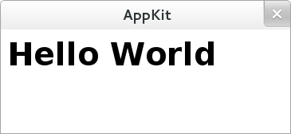

AppKit
============

    Desktop application framework based on Webkit, HTML5, CSS3, Javascript and Python

Now **AppKit** is on it's very early state. It's developed on fedora 17 & Gnome Desktop,  
However, It could be compatible with Ubuntu 12.04 and so on.

"AppKit" will be a framework for desktop application powered by `WebKit <http://www.webkit.org/>`_ engine, which means we can bring web technology such as HTML5, CSS3, Javascript and Web browser engine to desktop.

The main goal for now is to focus on library API which is inspired by `Flask <http://flask.pocoo.org/>`_ :). Application based on AppKit should be easy to write & combined with other libraries ( `Bootstrap <http://twitter.github.com/bootstrap/>`_, `AngularJS <http://angularjs.org/>`_, `Jinja2 <http://jinja.pocoo.org/docs/>`_ or whatever that you can think of :P )

Target Platforms
----------------
Linux

Installation
------------
Use Python `pip` command::

    $ pip install git+git://github.com/nitipit/appkit.git

Quick Start
-----------
example::

    #!/usr/bin/env python

    from appkit.app import App

    app = App()

    @app.route('^/$')
    def home():
        return '<a href="/test/Hello/World/" />Link</a>'

    @app.route('/test/(.+)/(.+)/')
    def test(text1=None, text2=None):
        return ('<h1>' + text1 + ' ' + text2 + '</h1>', 'text/html')

    app.run()

.. image:: _static/readme/1.png

