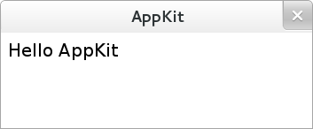

Tutorial
========

What AppKit do, really
----------------------
The main task for ``AppKit`` is to make HTML5 which is rendered on Webkit interact smoothly with Python which is better at dealing with desktop environment

The smallest application with HTML5
-----------------------------------
User interface with HTML5
~~~~~~~~~~~~~~~~~~~~~~~~~

.. code-block:: html

    #ui.html
    <html>
    <head><title>AppKit</title></head>
    <body>
    Hello AppKit
    </body>
    </html>

Initialize application by Python
~~~~~~~~~~~~~~~~~~~~~~~~~~~~~~~~

.. code-block:: python

    #app.py
    from appkit.api.v0_2_4 import App
    import codecs
    
    app = App(__file__)

    @app.route('^/$')
    def index():
        html = codecs.open('ui.html', 'r', encoding='utf8').read()
        return html

    app.run()

Now you can run
~~~~~~~~~~~~~~~

::

    $ python app.py

